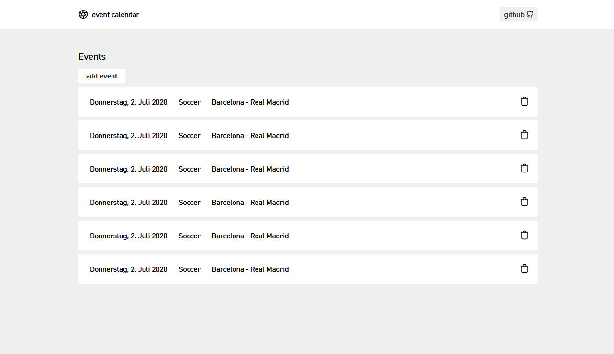
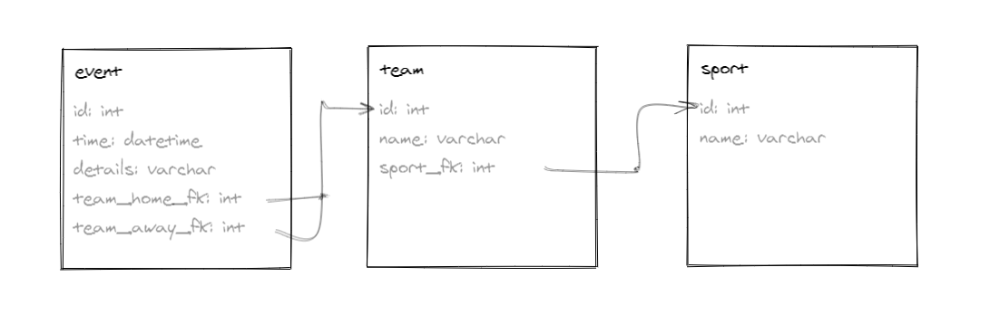

# vanilla php crud api example
Basic showcase, how i'd approach a very crude crud app, without any framework.
I'm not a php dev, so please don't take this too seriously. 

This is the result of a coding test

> Note: using a framework is obviously almost always a much better idea. use an ORM and proper abstraction, and dont make your life unnecessarily hard, like i did here.

## Usage
Run `docker-compose up -d`. Frontend is available on `localhost:3000`, Api on `localhost:8080`.

### api
Runs on PHP, uses mysql.

Implemented Route for events: `/events.php`. (GET, POST, DELETE)

> I've named the foreign keys with a postfix `_fk` instead of prefixing with `_` by accident.
> ..Habit. I dont want to bother replacing all instances for the example code.

### client
Micro Vuejs app. As simple as it gets. 
Would also make way more sense with a build pipeline, and modularized.
